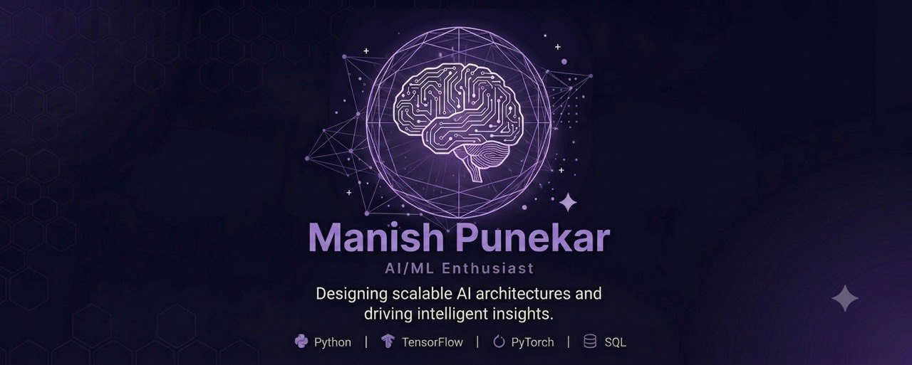

  

<h1 align="center">Manish Punekar</h1>

  

  

  

  

## 👨‍💻 About Me

<table>
<tr>
<td width="60%" valign="top">

## 👨‍💻 About Me

I'm a Computer Engineering student passionate about designing intelligent software and transforming ideas into AI-powered solutions. I enjoy building machine learning applications, exploring emerging AI technologies, and continuously improving my skills through hands-on projects and real-world problem solving.

### 🎯 Areas of Interest

- 🤖 Artificial Intelligence & Machine Learning
- 🧠 Deep Learning, Computer Vision & Neural Networks
- 💬 Generative AI, LLMs & NLP
- ⚡ AI Backend Development (FastAPI & Flask)
- 📊 Data Science & Predictive Analytics
- 🔍 Research, Experimentation & Open Source

</td>

<td width="40%" align="center">

</td>
</tr>
</table>

# 🛠️ Technologies & Tools

<h3 align="center">💻 Programming Languages</h3>

<table align="center">
<tr>
<td align="center" width="120">
 <b>Python</b>
</td>

<td align="center" width="120">
 <b>C++</b>
</td>

<td align="center" width="120">
 <b>C</b>
</td>

<td align="center" width="120">
 <b>SQL</b>
</td>

<td align="center" width="120">
 <b>R</b>
</td>
</tr>
</table>

 

<h3 align="center">🤖 AI & Machine Learning</h3>

<table align="center">
<tr>

<td align="center" width="120">
 <b>TensorFlow</b>
</td>

<td align="center" width="120">
 <b>PyTorch</b>
</td>

<td align="center" width="120">
 <b>Scikit-Learn</b>
</td>

<td align="center" width="120">
 <b>Keras</b>
</td>

<td align="center" width="120">
 <b>OpenCV</b>
</td>

</tr>

<tr>

<td align="center">
 <b>NumPy</b>
</td>

<td align="center">
 <b>Pandas</b>
</td>

<td align="center">
 <b>Matplotlib</b>
</td>

<td align="center">
 <b>SciPy</b>
</td>

<td align="center">
 <b>Seaborn</b>
</td>

</tr>
</table>

 

<h3 align="center">🧠 Generative AI</h3>

<table align="center">
<tr>

<td align="center" width="120">
 <b>Hugging Face</b>
</td>

<td align="center" width="120">
 <b>LangChain</b>
</td>

</tr>
</table>

 

<h3 align="center">📊 Data Science</h3>

<table align="center">

<tr>

<td align="center" width="160">
 <b>Jupyter Notebook</b>
</td>

<td align="center" width="160">
 <b>Google Colab</b>
</td>

<td align="center" width="160">
 <b>EDA</b>
</td>

</tr>

<tr>

<td align="center" width="160">
 <b>Feature Engineering</b>
</td>

<td align="center" width="160">
 <b>Data Cleaning</b>
</td>

<td align="center" width="160">
 <b>Data Visualization</b>
</td>

</tr>

</table>
 

<h3 align="center">⚙️ Backend Development</h3>

<table align="center">
<tr>

<td align="center" width="120">
 <b>FastAPI</b>
</td>

<td align="center" width="120">
 <b>Flask</b>
</td>

<td align="center" width="120">
🌐 <b>REST APIs</b>
</td>

</tr>
</table>

 

<h3 align="center">🗄️ Databases</h3>

<table align="center">
<tr>

<td align="center" width="120">
 <b>MySQL</b>
</td>

<td align="center" width="120">
 <b>SQLite</b>
</td>

</tr>
</table>

 

<h3 align="center">🛠 Developer Tools</h3>

<table align="center">
<tr>

<td align="center" width="120">
 <b>Git</b>
</td>

<td align="center" width="120">
 <b>GitHub</b>
</td>

<td align="center" width="120">
 <b>Docker</b>
</td>

<td align="center" width="120">
 <b>VS Code</b>
</td>

<td align="center" width="120">
 <b>Linux</b>
</td>

</tr>

<tr>

<td align="center">
 <b>Postman</b>
</td>

<td align="center">
 <b>Streamlit</b>
</td>

<td></td>
<td></td>
<td></td>

</tr>
</table>

 

<h3 align="center">📝 Other Skills</h3>

<table align="center">
<tr>

<td align="center" width="120">
 <b>Markdown</b>
</td>

<td align="center" width="120">
 <b>LaTeX</b>
</td>

<td align="center" width="120">
 <b>Bash</b>
</td>

<td align="center" width="120">
 <b>Shell Script</b>
</td>

</tr>
</table>

# 🚀 Featured Projects

<table>
<tr>

<td width="50%">

### 🤖 AI Resume Screening & ATS

AI-powered Applicant Tracking System that ranks resumes against job descriptions using NLP, TF-IDF, cosine similarity, and an intelligent ATS scoring engine.

**Tech Stack**

`Python` `Flask` `Scikit-Learn` `NLP` `TF-IDF`

</td>

<td width="50%">

### 🤖 Multi-Agent Task Orchestration

An AI system that coordinates multiple autonomous agents to execute complex workflows, delegate tasks, and optimize execution pipelines.

**Tech Stack**

`Python` `Multi-Agent AI` `LLMs` `Automation`

</td>

</tr>

<tr>

<td width="50%">

### 🏭 Intelligent Multi-Robot Warehouse Path Planner

Path planning and collision avoidance system for autonomous warehouse robots using intelligent routing algorithms.

**Tech Stack**

`Python` `Robotics` `Path Planning` `Algorithms`

</td>

<td width="50%">

### 📊 Customer Churn Prediction

Machine learning model for predicting customer churn and generating risk scores to support business decision-making.

**Tech Stack**

`Python` `Scikit-Learn` `Pandas` `Machine Learning`

</td>

</tr>
</table>

---

# 🎯 Current Focus

<table>
<tr>
<td width="50%">

### 🚀 Building

- 🤖 AI Resume Screening & ATS
- 🧠 Multi-Agent AI Systems
- ⚡ Production-Ready AI Applications

</td>

<td width="50%">

### 📚 Learning

- 🧠 Advanced Deep Learning
- 🤗 Hugging Face
- 🔗 LangChain
- 🐳 Docker & MLOps

</td>
</tr>

<tr>
<td>

### 🔬 Exploring

- 💬 Large Language Models (LLMs)
- 👁️ Computer Vision
- 🤖 AI Agents

</td>

<td>

### 🤝 Open To

- 💼 AI Engineer Internships
- 🌍 Open Source
- 🔬 Research Collaboration

</td>
</tr>
</table>
# 🔥 Contribution Streak

---

# 📬 Connect With Me

---

## 💜 Thanks for Visiting!

Building intelligent AI systems that solve real-world problems.

**AI Engineer • Machine Learning • Generative AI**

⭐ Open to collaborations, internships, and open source.

